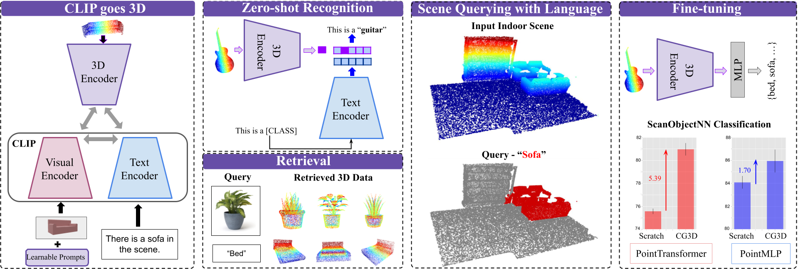

# CLIP-goes-3D

Official code for the paper "CLIP goes 3D: Leveraging Prompt Tuning for Language Grounded 3D Recognition"

[arxiv](https://arxiv.org/abs/2303.11313) / [website](https://jeya-maria-jose.github.io/cg3d-web/)



This repository includes the pre-trained models, evaluation and training codes for pre-training, zero-shot, and fine-tuning experiments of CG3D. It is built on the [Point-BERT](https://github.com/lulutang0608/Point-BERT) codebase. Please see the end of this document for a full list of code references.

To-Do:
- [x] Setup
- [x] Model weights from pre-training
- [x] Model weights from fine-tuning
- [x] Pre-training CG3D
- [x] Zero-shot inference
- [x] Fine-tune inference
- [ ] Fine-tuning CG3D
- [ ] Retrieval

### Environment set-up

The known working environment configuration is 

```
python 3.9
pytorch 1.12
CUDA 11.6
```

 
1. Install the conda virtual environment using the provided .yml file.
   ```
   conda env create -f environment.yml 
   ```
(OR)

1. Install dependencies manually.

   ```
   conda create -n cg3d
   conda activate cg3d
   ```

   ``` 
   pip install -r requirements.txt

   ```
   ```
   conda install -c anaconda scikit-image scikit-learn scipy
   ```

   ```
   pip install git+https://github.com/openai/CLIP.git
   ```
   
   
   ```
   pip install --upgrade https://github.com/unlimblue/KNN_CUDA/releases/download/0.2/KNN_CUDA-0.2-py3-none-any.whl
   ```
   ```
   cd ./extensions/chamfer_dist
   python setup.py develop
   ```

2. Build modified timm from scratch

   extract modified timm package [here](https://drive.google.com/file/d/1Tr6t6mnLhcIPKIgNjJuoqxJyFo6MBtJu/view?usp=share_link)


   ```
   cd ./models/SLIP/pytorch-image-models
   pip install -e .
   ```
3. Install [PointNet ops](https://github.com/erikwijmans/Pointnet2_PyTorch)

   
   ```
   cd third_party/Pointnet2_PyTorch
   pip install -e .
   pip install pointnet2_ops_lib/.
   ```
   
4.  Install [PyGeM](https://mathlab.github.io/PyGeM/)
   
   ```
   cd third_party/PyGeM
   python setup.py install
   ```

### Dataset set-up

1. Download point cloud datasets for pre-training and fine-tuning.

  - Download [ShapeNetCore v2](https://shapenet.org/).
  - Download [ModelNet](https://shapenet.cs.stanford.edu/media/modelnet40_normal_resampled.zip)
  - Download [ScanObjectNN](https://hkust-vgd.github.io/scanobjectnn/)

    Save and unzip the above datasets.
  
 2. Render views of textured CAD models of ShapeNet using [this](https://github.com/nv-tlabs/GET3D/blob/master/render_shapenet_data/README.md) repository. We use a scale of 0.7 and 5 total views. 
 
 3. The data should be organized as 

   ```
   ├── data (this may be wherever you choose)
   │   ├── modelnet40_normal_resampled
   │   │   │── modelnet10/40_shape_names.txt
   │   │   │── modelnet10/40_train/test.txt 
   │   │   │── airplane
   │   │   │── ...
   │   │   │── laptop 
   │   ├── ShapeNet55
   │   │   │── train.txt
   │   │   │── test.txt
   │   │   │── shapenet_pc
   │   │   │   |── 03211117-62ac1e4559205e24f9702e673573a443.npy
   │   │   │   |── ...
   │   ├── shapenet_render
   │   │   │── train_img.txt
   │   │   │── val_img.txt
   │   │   │── shape_names.txt
   │   │   │── taxonomy.json
   │   │   │── camera
   │   │   │── img
   │   │   │   |── 02691156
   │   │   │   |── ...
   │   ├── ScanObjectNN
   │   │   │── main_split
   │   │   │── ...


   ```  
  
## 1) Model weights

### a) Pre-trained CG3D weights

Download SLIP model weights from [here](https://dl.fbaipublicfiles.com/slip/slip_base_100ep.pt).


### PointTransformer 
-------------------------------------------------
| No. of points | Model file  |Task| Configuration file |
| ----------- | ----------- |----------- | -------------------|
|1024| [download](https://drive.google.com/file/d/14aFau0H5Zn4byH6ahq7_PI7xzBSL18Ao/view?usp=share_link) | Pre-training|[link](cfgs/ShapeNet55_models/PointTransformerVPT.yaml) |
|8192| [download](https://drive.google.com/file/d/1L_BPO45_AQEroLSYXhaUbPNYEB1YBCFV/view?usp=share_link) | Pre-training|[link](cfgs/ShapeNet55_models/PointTransformerVPT.yaml) |


### PointMLP

-------------------------------------------------
| No. of points | Model file  |Task| Configuration file |
| ----------- | ----------- |----------- | -------------------|
|1024| [download](https://drive.google.com/file/d/1V66h1iGbfY-KEYGyMzV_T2QbKYsZa5p9/view?usp=share_link) | Pre-training|[link](cfgs/ShapeNet55_models/PointMLP_VPT.yaml) |
|8192| [download](https://drive.google.com/file/d/1NX0x1FRgnZrZiEdaIRcp_V6Enb6WZolX/view?usp=share_link) | Pre-training|[link](cfgs/ShapeNet55_models/PointMLP_VPT.yaml) |

#### Test Zero-Shot performance

  ```
  python eval.py --config {CONFIG} --exp_name {NAME FOR EXPT}  --ckpts {CKPT PATH} --slip_model {PATH TO SLIP MODEL}
  ```
  
### b) Fine-tuning model weights

### PointTransformer

|    Dataset   |                                     Model Weights                                    |                                          TFBoard                                          |
|:------------:|:------------------------------------------------------------------------------------:|:-----------------------------------------------------------------------------------------:|
| ScanObjectNN | [download](https://drive.google.com/drive/folders/1qCtzrPulUK4gtPm4WGtIY_cNrfzTJSoN?usp=sharing) |             [link](https://tensorboard.dev/experiment/wWu7pF14Sd6dmUzu1Pah7Q/#scalars)            |
|   ModelNet   | [download](https://drive.google.com/drive/folders/16BfhaKWKUVr7e1xVb5llVQr6UkrnBBeF?usp=sharing) | [link](https://tensorboard.dev/experiment/yKmx71h3RwyDd2udvpaMZw/#scalars&_smoothingWeight=0.548) |

### PointMLP

|    Dataset   |                                     Model Weights                                    |                           TFBoard                          |
|:------------:|:------------------------------------------------------------------------------------:|:----------------------------------------------------------:|
| ScanObjectNN | [download](https://drive.google.com/drive/folders/1VWdDafCm3KNkA3V_nOND6E1wweQYCT3X?usp=sharing) | [link](https://tensorboard.dev/experiment/Puw4RvPqS1CrKHVma20f4g/) |
|   ModelNet   | [download](https://drive.google.com/drive/folders/1xgGkt2aOFCCG_qX0SqHoUAwHnvMg6vqF?usp=sharing) | [link](https://tensorboard.dev/experiment/k8q6cMhQSj6tkSVDJ8jkag/) |


## 2) Training CG3D

### a) Pre-training

- Change data paths to relevant locations in ```cfgs/dataset_configs/```

- Pre-train PointTransformer on ShapeNet under the CG3D framework:

    ```
    python main.py  --exp_name {NAME FOR EXPT} --config cfgs/ShapeNet55_models/PointTransformerVPT.yaml  --pretrain    --out_dir {OUTPUT DIR PATH}  --text --image --clip --VL SLIP --visual_prompting --npoints 1024 --slip_model {PATH TO SLIP MODEL}

    ```
    
- Pre-train PointMLP on ShapeNet under the CG3D framework:

   ```
   python main.py  --exp_name {NAME FOR EXPT} --config cfgs/ShapeNet55_models/PointMLP_VPT.yaml  --pretrain    --out_dir {OUTPUT DIR PATH}  --text --image --clip --VL SLIP --visual_prompting --npoints 1024 --slip_model {PATH TO SLIP MODEL}

    ```

### Zero-Shot Inference

  ```
  python eval.py --config cfgs/ShapeNet55_models/{CONFIG} --exp_name {NAME FOR EXPT}  --ckpts {CKPT PATH} --slip_model {PATH TO SLIP MODEL} --zshot --npoints {1024,8192}
  ```
  
 ### Fine-tuning Inference

 ```
 python eval.py --config  cfgs/{ModelNet_models,ScanObjectNN_models}/{CONFIG} --exp_name {NAME FOR EXPT}  --ckpts {CKPT PATH} --npoints {1024,8192}
 ```

  
  
  
  
### References

 - [PointBert](https://github.com/lulutang0608/Point-BERT)
 - [PointMLP](https://github.com/ma-xu/pointMLP-pytorch)
 - [SLIP](https://github.com/facebookresearch/SLIP)
 - [CLIP](https://github.com/openai/CLIP)
 - [Pointnet2_PyTorch](https://github.com/erikwijmans/Pointnet2_PyTorch)

 


